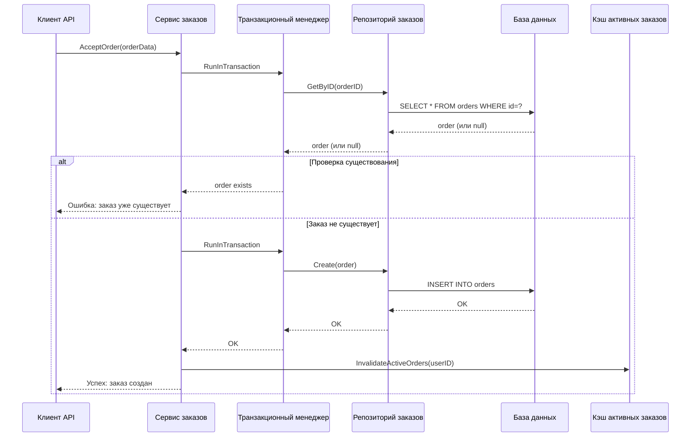
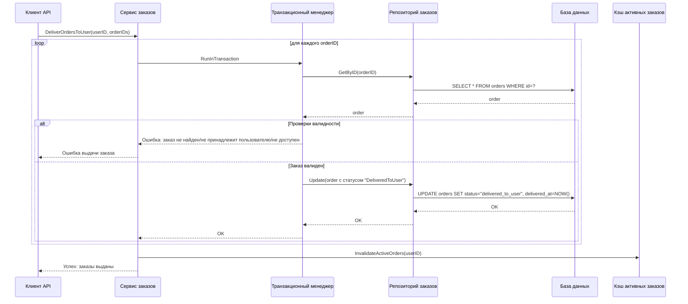
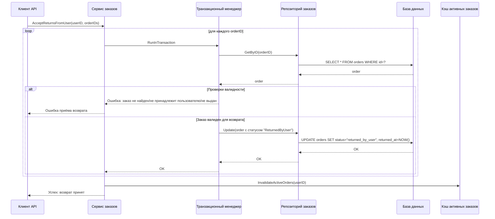
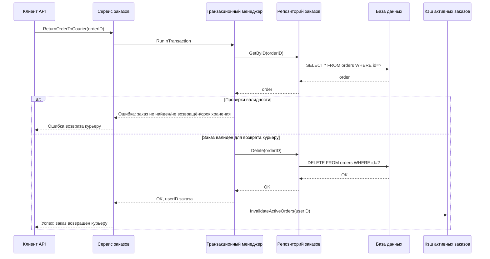
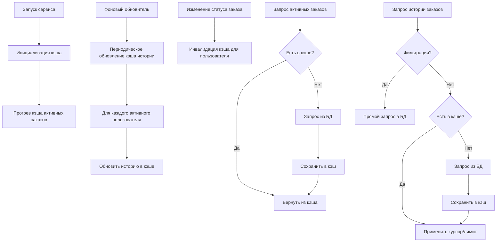

# Сервис пункта выдачи заказов (ПВЗ)

## Описание

Сервис управления заказами в пункте выдачи, включающий следующие функции:
- Принятие заказа от курьера
- Выдача заказа клиенту
- Приём возврата от клиента
- Возврат заказа курьеру
- Хранение в кэше списка актуальных заказов
- Просмотр и хранение в кэше истории заказов

## Архитектура сервиса

#### Принятие заказа от курьера



#### Выдача заказа клиенту



#### Приём возврата от клиента



#### Возврат заказа курьеру



### Механизм кэширования



## Особенности реализации

1. **Транзакционная безопасность**: Все операции с данными в БД выполняются в транзакциях, что гарантирует целостность данных и атомарность операций.

2. **Кэширование**:
   - Активные заказы кэшируются для быстрого доступа
   - История заказов кэшируется и обновляется в фоновом режиме
   - Кэш инвалидируется при изменении статуса заказа

3. **Проверки**:
   - Проверка принадлежности заказа пользователю
   - Проверка валидности состояния заказа для операции
   - Проверка сроков хранения и возврата

4. **Мемкэш**: Используется Memcached для хранения кэша, что обеспечивает:
   - Быстрый доступ к данным
   - Автоматическое истечение срока жизни (TTL)
   - Распределенное хранение

## Запуск сервиса

```bash
make build
./bin/pvz-service
```

Конфигурация сервиса находится в файле `configs/config.yml`.
