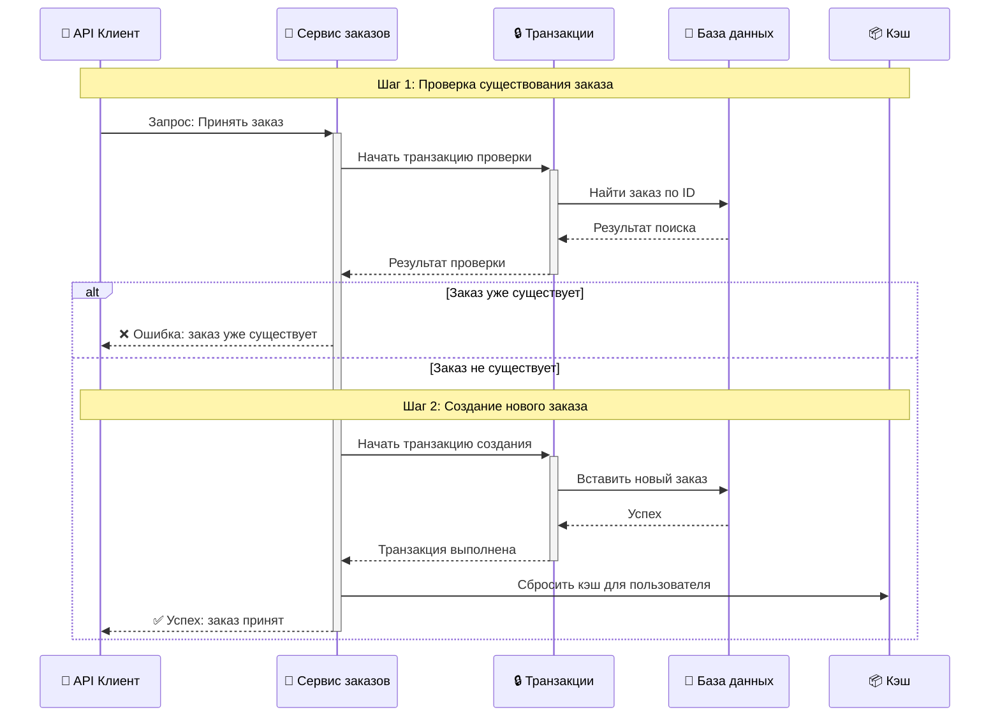
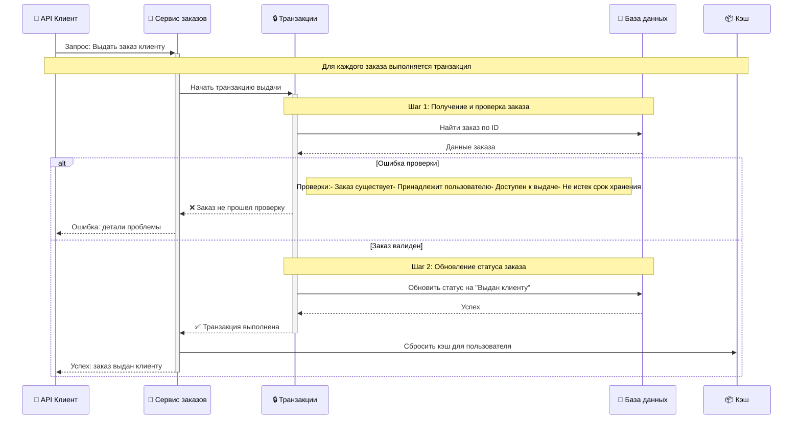
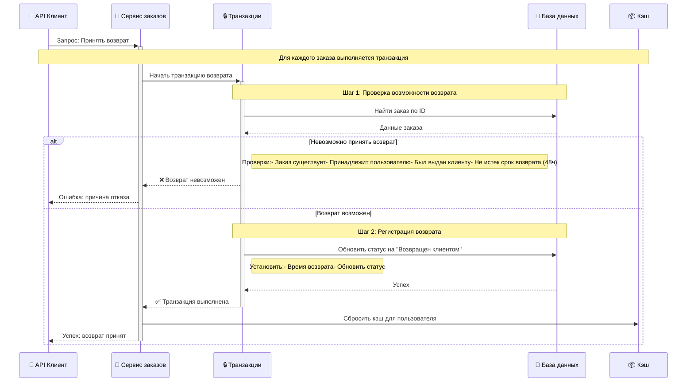
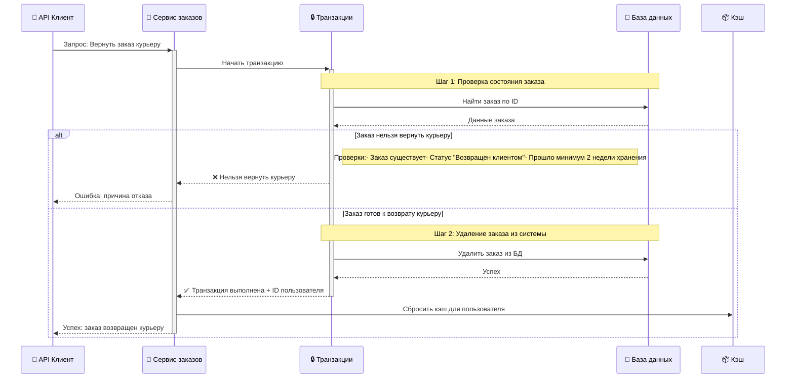

# Что у меня сейчас имеется

Сервис управления заказами в пункте выдачи, включающий следующие функции:
- Принятие заказа от курьера
- Выдача заказа клиенту
- Приём возврата от клиента
- Возврат заказа курьеру
- Хранение в кэше списка актуальных заказов
- Просмотр и хранение в кэше истории заказов

## Архитектура сервиса

### Принятие заказа от курьера

```mermaid
sequenceDiagram
    participant Client as 📱 API Клиент
    participant Service as 🔄 Сервис заказов
    participant TxManager as 🔒 Транзакции
    participant DB as 💾 База данных
    participant Cache as 📦 Кэш

    Note over Client,Cache: Шаг 1: Проверка существования заказа
    
    Client->>+Service: Запрос: Принять заказ
    Service->>+TxManager: Начать транзакцию проверки
    TxManager->>DB: Найти заказ по ID
    DB-->>TxManager: Результат поиска
    TxManager-->>-Service: Результат проверки
    
    alt Заказ уже существует
        Service-->>Client: ❌ Ошибка: заказ уже существует
    else Заказ не существует
        Note over Client,Cache: Шаг 2: Создание нового заказа
        
        Service->>+TxManager: Начать транзакцию создания
        TxManager->>DB: Вставить новый заказ
        DB-->>TxManager: Успех
        TxManager-->>-Service: Транзакция выполнена
        
        Service->>Cache: Сбросить кэш для пользователя
        Service-->>-Client: ✅ Успех: заказ принят
    end
```

### Выдача заказа клиенту

```mermaid
sequenceDiagram
    participant Client as 📱 API Клиент
    participant Service as 🔄 Сервис заказов
    participant TxManager as 🔒 Транзакции
    participant DB as 💾 База данных
    participant Cache as 📦 Кэш

    Client->>+Service: Запрос: Выдать заказ клиенту
    
    Note over Client,Cache: Для каждого заказа выполняется транзакция
    
    Service->>+TxManager: Начать транзакцию выдачи
    
    Note over TxManager,DB: Шаг 1: Получение и проверка заказа
    TxManager->>DB: Найти заказ по ID
    DB-->>TxManager: Данные заказа
    
    alt Ошибка проверки
        Note right of TxManager: Проверки:- Заказ существует- Принадлежит пользователю- Доступен к выдаче- Не истек срок хранения
        TxManager-->>Service: ❌ Заказ не прошел проверку
        Service-->>Client: Ошибка: детали проблемы
    else Заказ валиден
        Note over TxManager,DB: Шаг 2: Обновление статуса заказа
        
        TxManager->>DB: Обновить статус на "Выдан клиенту"
        DB-->>TxManager: Успех
        TxManager-->>-Service: ✅ Транзакция выполнена
        
        Service->>Cache: Сбросить кэш для пользователя
        Service-->>-Client: Успех: заказ выдан клиенту
    end
```

### Приём возврата от клиента

```mermaid
sequenceDiagram
    participant Client as 📱 API Клиент
    participant Service as 🔄 Сервис заказов
    participant TxManager as 🔒 Транзакции
    participant DB as 💾 База данных
    participant Cache as 📦 Кэш

    Client->>+Service: Запрос: Принять возврат
    
    Note over Client,Cache: Для каждого заказа выполняется транзакция
    
    Service->>+TxManager: Начать транзакцию возврата
    
    Note over TxManager,DB: Шаг 1: Проверка возможности возврата
    TxManager->>DB: Найти заказ по ID
    DB-->>TxManager: Данные заказа
    
    alt Невозможно принять возврат
        Note right of TxManager: Проверки:- Заказ существует- Принадлежит пользователю- Был выдан клиенту- Не истек срок возврата (48ч)
        TxManager-->>Service: ❌ Возврат невозможен
        Service-->>Client: Ошибка: причина отказа
    else Возврат возможен
        Note over TxManager,DB: Шаг 2: Регистрация возврата
        
        TxManager->>DB: Обновить статус на "Возвращен клиентом"
        Note right of TxManager: Установить:- Время возврата- Обновить статус
        DB-->>TxManager: Успех
        TxManager-->>-Service: ✅ Транзакция выполнена
        
        Service->>Cache: Сбросить кэш для пользователя
        Service-->>-Client: Успех: возврат принят
    end
```

### Возврат заказа курьеру

```mermaid
sequenceDiagram
    participant Client as 📱 API Клиент
    participant Service as 🔄 Сервис заказов
    participant TxManager as 🔒 Транзакции
    participant DB as 💾 База данных
    participant Cache as 📦 Кэш

    Client->>+Service: Запрос: Вернуть заказ курьеру
    Service->>+TxManager: Начать транзакцию
    
    Note over TxManager,DB: Шаг 1: Проверка состояния заказа
    TxManager->>DB: Найти заказ по ID
    DB-->>TxManager: Данные заказа
    
    alt Заказ нельзя вернуть курьеру
        Note right of TxManager: Проверки:- Заказ существует- Статус "Возвращен клиентом"- Прошло минимум 2 недели хранения
        TxManager-->>Service: ❌ Нельзя вернуть курьеру
        Service-->>Client: Ошибка: причина отказа
    else Заказ готов к возврату курьеру
        Note over TxManager,DB: Шаг 2: Удаление заказа из системы
        
        TxManager->>DB: Удалить заказ из БД
        DB-->>TxManager: Успех
        TxManager-->>-Service: ✅ Транзакция выполнена + ID пользователя
        
        Service->>Cache: Сбросить кэш для пользователя
        Service-->>-Client: Успех: заказ возвращен курьеру
    end
```

