# Что у меня сейчас имеется

Сервис управления заказами в пункте выдачи, включающий следующие функции:
- Принятие заказа от курьера
- Выдача заказа клиенту
- Приём возврата от клиента
- Возврат заказа курьеру
- Хранение в кэше списка актуальных заказов
- Просмотр и хранение в кэше истории заказов

## Архитектура сервиса

#### Принятие заказа от курьера

#### Выдача заказа клиенту

#### Приём возврата от клиента

```mermaid
sequenceDiagram
    participant Client as Клиент API
    participant Service as Сервис заказов
    participant TxManager as Транзакционный менеджер
    participant Repo as Репозиторий заказов
    participant DB as База данных
    participant Cache as Кэш активных заказов

    Client->>Service: AcceptReturnsFromUser(userID, orderIDs)
    
    loop для каждого orderID
        Service->>TxManager: RunInTransaction
        TxManager->>Repo: GetByID(orderID)
        Repo->>DB: SELECT * FROM orders WHERE id=?
        DB-->>Repo: order
        Repo-->>TxManager: order
        
        alt Проверки валидности
            TxManager-->>Service: Ошибка: заказ не найден/не принадлежит пользователю/не выдан
            Service-->>Client: Ошибка приёма возврата
        else Заказ валиден для возврата
            TxManager->>Repo: Update(order с статусом "ReturnedByUser")
            Repo->>DB: UPDATE orders SET status="returned_by_user", returned_at=NOW()
            DB-->>Repo: OK
            Repo-->>TxManager: OK
            TxManager-->>Service: OK
        end
    end
    
    Service->>Cache: InvalidateActiveOrders(userID)
    Service-->>Client: Успех: возврат принят
```

#### Возврат заказа курьеру

